### Final Outcome ###
Our target to integrate FAB into an existing Android App and creating submenus. Settings icon is used as FAB. Clicking on it will open its submenus: Save, Edit and Photo. Clicking on X will close submenus and Settings icon will re-appear.

This is how main screen will look after FAB integrated into it.

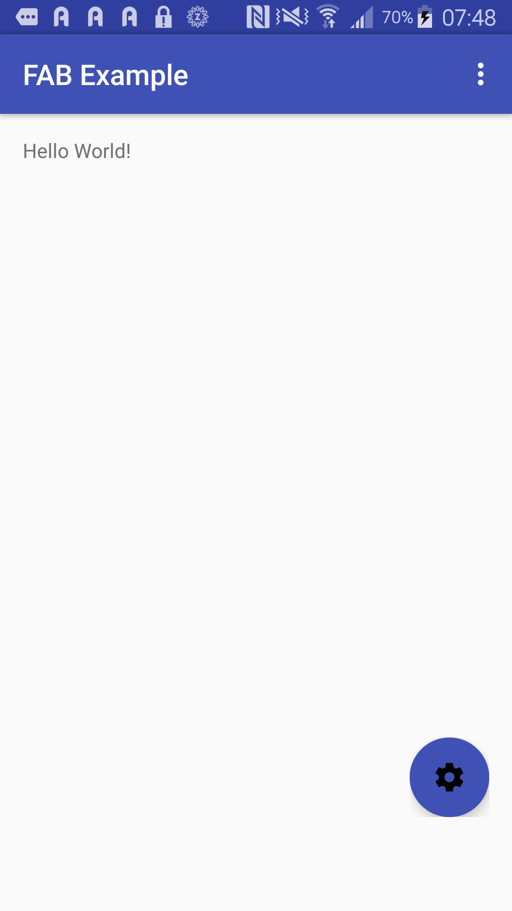


Clicking on `Settings` icon will open sub menus:

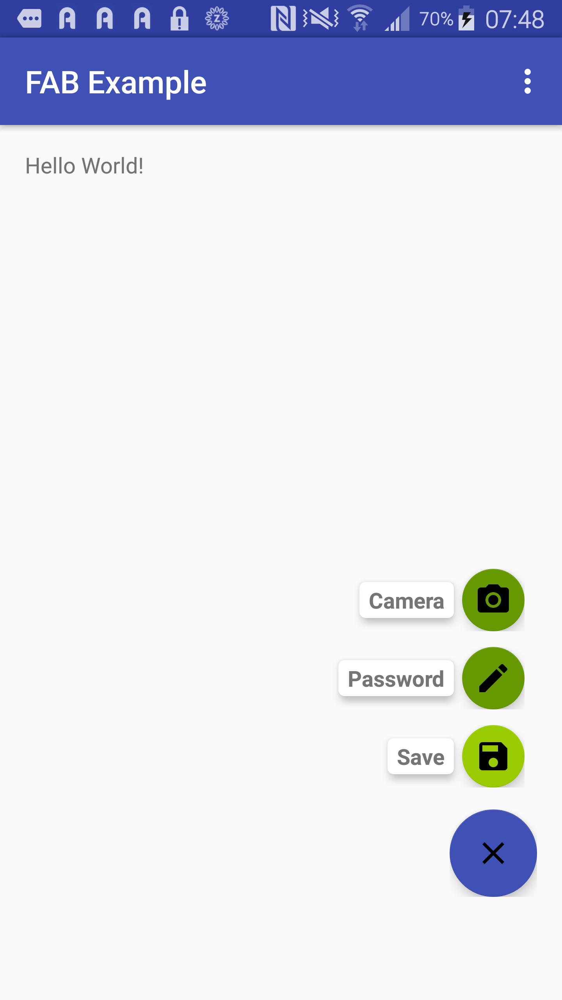

### Create Android Studio Project ###
***Step#1:*** Create New Project in Android Studio:

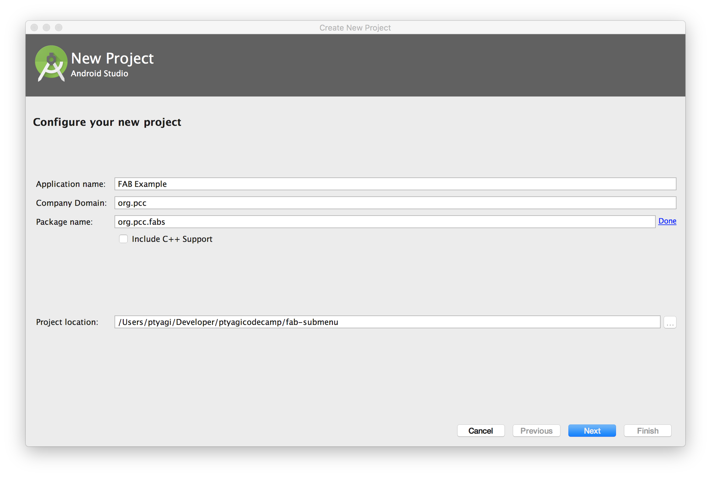

***Step#2:*** Choose Blank Activity:
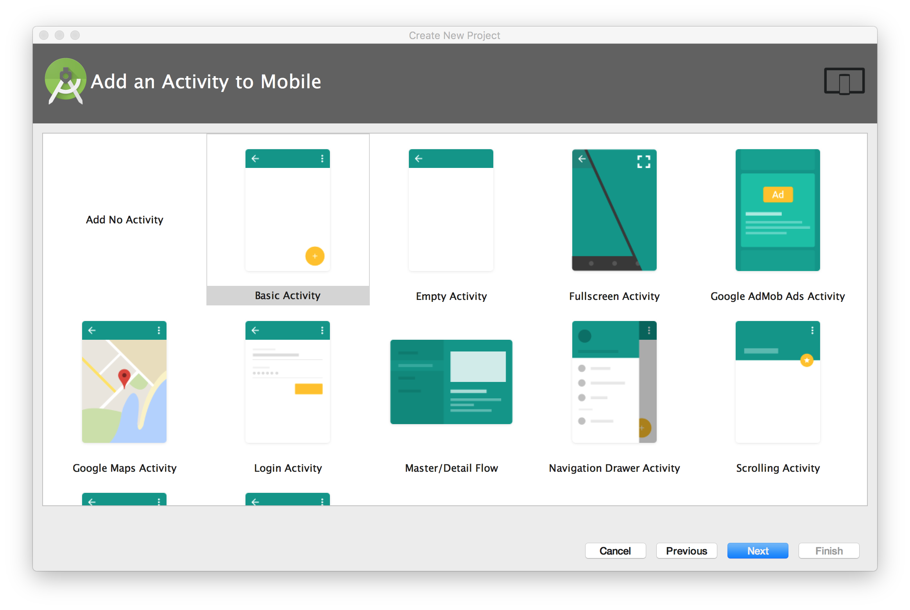

***Step#3:*** This how your project would look like :
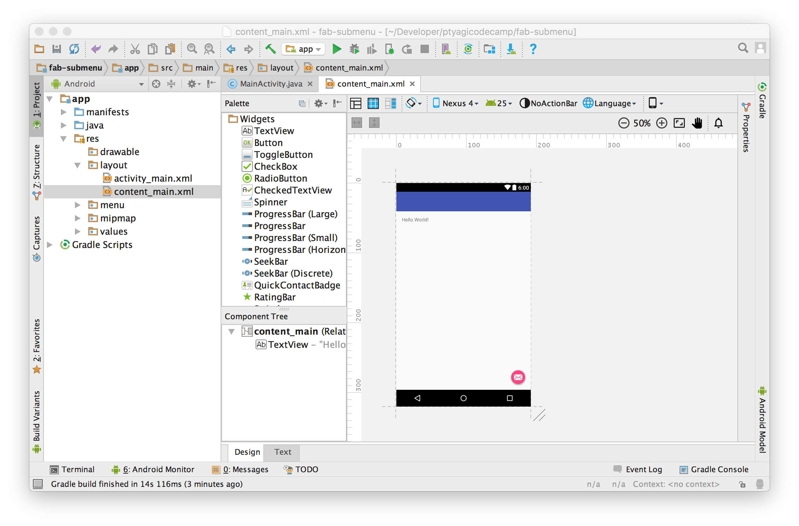


### Preparation ###
***Step#1:***  Assets:
I need few assets to be used as FAB submenu icons.
I used Android Studio’s built-in tool to generate Vector Assets.
You can access this tool right clicking on `app` module → Click `New` → Click on `Vector Assets`

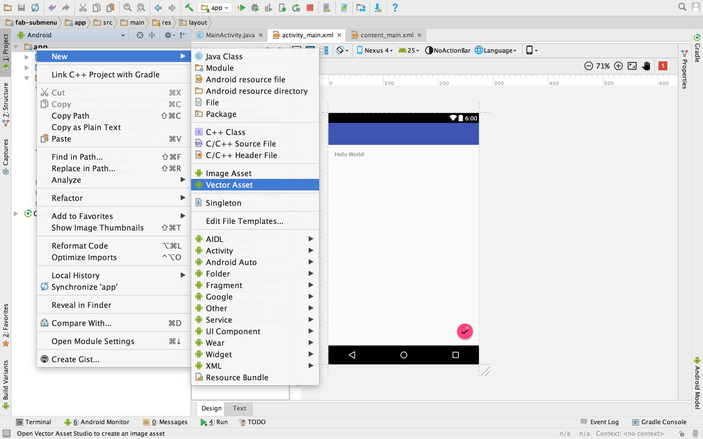
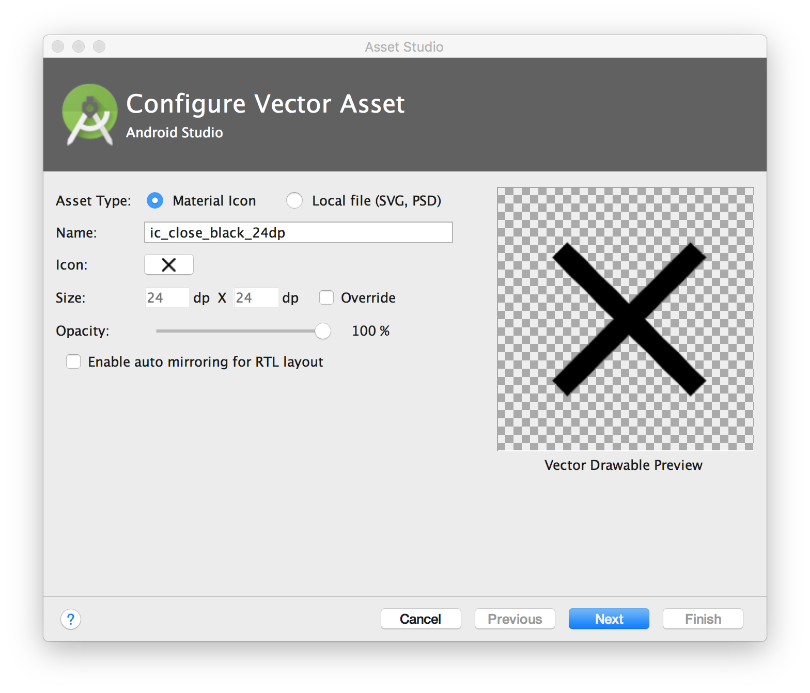
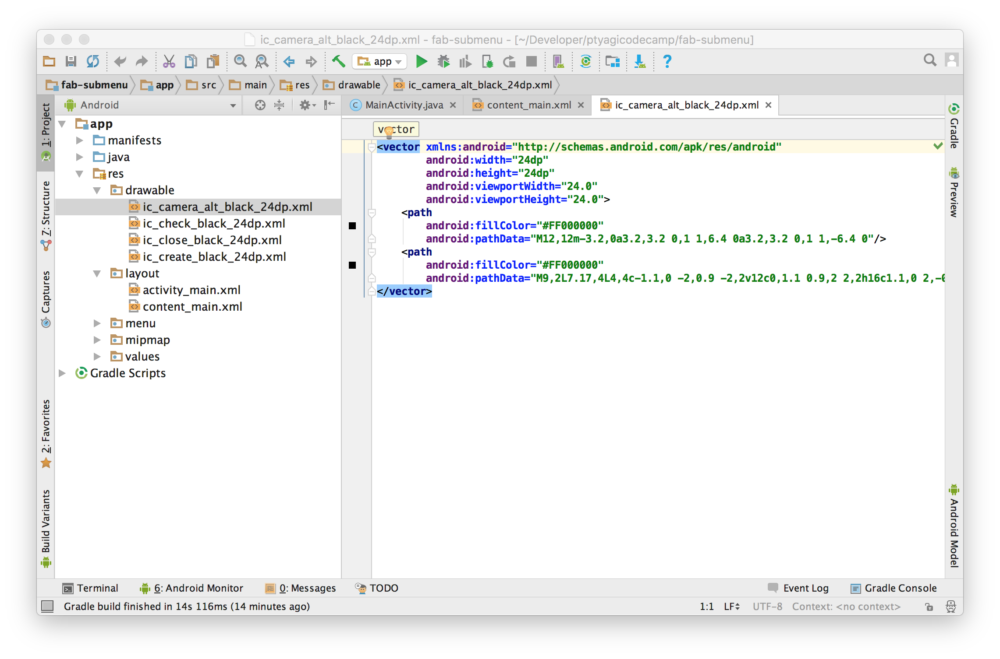


***Step#2:***  Configuration:
I’ll be using cardView component to display description for sub menu items.
Here’s how you can add it as a dependency in your `build.gradle`:
`compile 'com.android.support:cardview-v7:25.1.0'`

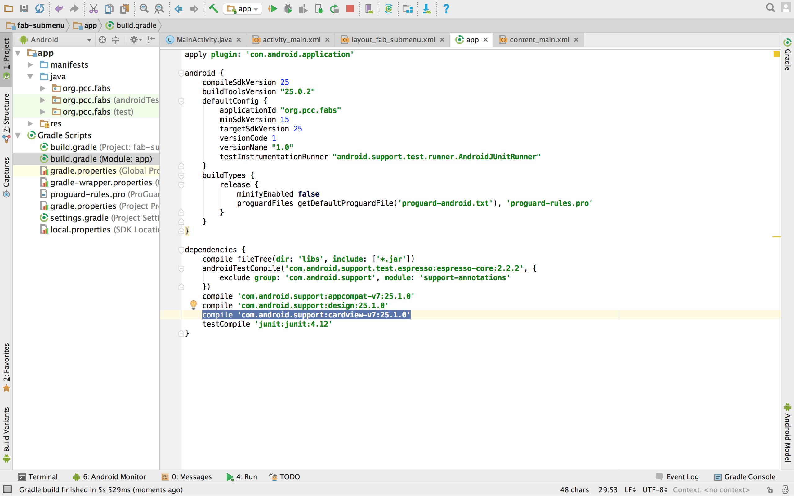

#### XML Layout ###
***Step#1:*** Create a new layout file to contains FAB and its sub menu items.

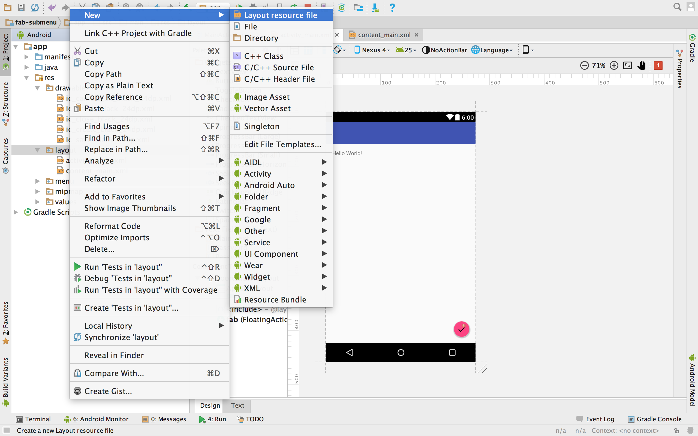

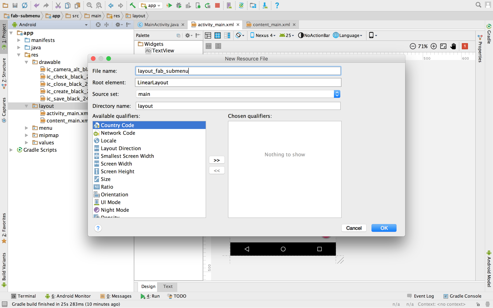

I named it as `layout_fab_submenu.xml`. It’s a `FrameLayout`.

I chose FrameLayout because I wanted a screen floating atop of existing screen and
a holder for all FAB menu items. Don’t forget to set the top margin to `android:layout_marginTop="?attr/actionBarSize"
` to avoid Actionbar overlapping.

```
<FrameLayout
    xmlns:android="http://schemas.android.com/apk/res/android"
    xmlns:app="http://schemas.android.com/apk/res-auto"
    android:id="@+id/fabFrame"
    android:layout_width="match_parent"
    android:layout_height="match_parent"
    android:layout_marginTop="?attr/actionBarSize"
    android:paddingBottom="@dimen/activity_vertical_margin"
    android:paddingLeft="@dimen/activity_horizontal_margin"
    android:paddingRight="@dimen/activity_horizontal_margin"
    android:paddingTop="@dimen/activity_vertical_margin"
    android:orientation="vertical">

    .....
</FrameLayout>
```

***Step#2:*** Layout for FAB SubMenu items

Now, I want to create one `LinearLayout` for each ***FAB***. Since I want all of the FAB items
to be at bottom right corner of screen, so I will use `android:layout_gravity=bottom|end`.
Every sub menu will have its own `LinearLayout` like following. Each `LinearLayout` has one `CardView`
to hold `TextView` for explaining FAB's purpose and one `android.support.design.widget.FloatingActionButton` next to it.

```
<LinearLayout
        android:id="@+id/layoutFabSave"
        android:layout_width="wrap_content"
        android:layout_height="wrap_content"
        android:gravity="center_vertical"
        android:layout_gravity="bottom|end"
        android:layout_marginRight="8dp"
        android:layout_marginBottom="120dp"
        android:layout_marginEnd="8dp"
        android:orientation="horizontal">

        <android.support.v7.widget.CardView
            android:layout_width="wrap_content"
            android:layout_height="wrap_content"
            app:cardBackgroundColor="@color/cardview_light_background"
            app:cardCornerRadius="@dimen/cardCornerRadius"
            app:cardElevation="@dimen/cardElevation"
            app:cardUseCompatPadding="true" >
            <TextView
                android:id="@+id/cvtSave"
                android:layout_width="wrap_content"
                android:layout_height="wrap_content"
                android:text="@string/save"
                android:textAppearance="?android:attr/textAppearanceSmall"
                android:textStyle="bold"
                android:paddingRight="@dimen/cardview_horizontal_padding"
                android:paddingLeft="@dimen/cardview_horizontal_padding"
                android:paddingBottom="@dimen/cardview_vertical_padding"
                android:paddingTop="@dimen/cardview_vertical_padding" />
        </android.support.v7.widget.CardView>

        <android.support.design.widget.FloatingActionButton
            android:id="@+id/fabSave"
            android:layout_width="wrap_content"
            android:layout_height="wrap_content"
            android:src="@drawable/ic_save_black_24dp"
            app:backgroundTint="@android:color/holo_green_light"
            app:fabSize="mini" />

    </LinearLayout>
```


### Lets check out More Code ###

In order to support FAB opening and closing, you would need to write two methods. One is to make sub menus
visible, and other is to hide sub menus and only show main FAB which is `Settings` icon is our case.
When `Settings` FAB expands, it turns into 'X' to give option to be able to close expanded sub menus.
These are the two methods you would need:
```
//closes FAB submenus
    private void closeSubMenusFab(){
        layoutFabSave.setVisibility(View.INVISIBLE);
        layoutFabEdit.setVisibility(View.INVISIBLE);
        layoutFabPhoto.setVisibility(View.INVISIBLE);
        fabSettings.setImageResource(R.drawable.ic_settings_black_24dp);
        fabExpanded = false;
    }

    //Opens FAB submenus
    private void openSubMenusFab(){
        layoutFabSave.setVisibility(View.VISIBLE);
        layoutFabEdit.setVisibility(View.VISIBLE);
        layoutFabPhoto.setVisibility(View.VISIBLE);
        //Change settings icon to 'X' icon
        fabSettings.setImageResource(R.drawable.ic_close_black_24dp);
        fabExpanded = true;
    }
```

Now, its time to hook them up in the main code to make it functional. Lets start with `onCreate()` method:

```
public class MainActivity extends AppCompatActivity {

    //boolean flag to know if main FAB is in open or closed state.
    private boolean fabExpanded = false;
    private FloatingActionButton fabSettings;

    //Linear layout holding the Save submenu
    private LinearLayout layoutFabSave;

    //Linear layout holding the Edit submenu
    private LinearLayout layoutFabEdit;
    private LinearLayout layoutFabPhoto;

    @Override
    protected void onCreate(Bundle savedInstanceState) {
        super.onCreate(savedInstanceState);
        setContentView(R.layout.activity_main);
        Toolbar toolbar = (Toolbar) findViewById(R.id.toolbar);
        setSupportActionBar(toolbar);

        fabSettings = (FloatingActionButton) this.findViewById(R.id.fabSetting);

        layoutFabSave = (LinearLayout) this.findViewById(R.id.layoutFabSave);
        layoutFabEdit = (LinearLayout) this.findViewById(R.id.layoutFabEdit);
        layoutFabPhoto = (LinearLayout) this.findViewById(R.id.layoutFabPhoto);

        //When main Fab (Settings) is clicked, it expands if not expanded already.
        //Collapses if main FAB was open already.
        //This gives FAB (Settings) open/close behavior
        fabSettings.setOnClickListener(new View.OnClickListener() {
            @Override
            public void onClick(View view) {
                if (fabExpanded == true){
                    closeSubMenusFab();
                } else {
                    openSubMenusFab();
                }
            }
        });

        //Only main FAB is visible in the beginning
        closeSubMenusFab();
    }

    ....
}
```


### Congratulations! ###
Yay ! You got FAB integrated along with sub menu in less than 5 minutes. Its time to celebrate :)

Source code is available at <a href="https://github.com/ptyagicodecamp/fab-submenu">Github </a>